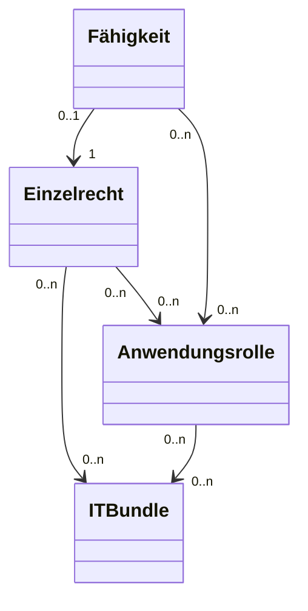

# README

Resource is any asset, tangible or intangible, that an organization owns, leases, or utilizes to perform specific functions within an IT environment. This includes hardware like servers, software applications, network devices, and even human resources.
Ressource bezieht sich auf jedes Asset, ob materiell oder immateriell, das eine Organisation besitzt, mietet oder nutzt, um spezifische Funktionen innerhalb einer IT-Umgebung auszuführen. Dazu gehören Hardware wie Server, Softwareanwendungen, Netzwerkgeräte und sogar personelle Ressourcen.
Resource Capability (Ressourcenfähigkeit oder Fähigkeit)

Resource Capability refers to the specific actions, functions, or operations that a resource—such as an application, system, IT component, or database element—can perform within an IT environment. This term includes the internal definition of roles within the resource itself, allowing for the mapping of these capabilities to functional roles like “Specialist” in complex applications. While defining capabilities internally can reduce complexity in external IAM tools, it should generally be the exception rather than the rule. Ideally, role-based access management should be centralized in IAM systems to maintain consistency and ease of management across the organization. Internal role definitions should only be used when necessary to address specific application requirements or complexities.
Ressourcenfähigkeit bezeichnet die spezifischen Aktionen, Funktionen oder Operationen, die eine Ressource—wie eine Anwendung, ein System, eine IT-Komponente oder ein Datenbankelement—innerhalb einer IT-Umgebung ausführen kann. Dieser Begriff umfasst auch die interne Definition von Rollen innerhalb der Ressource selbst, wodurch diese Fähigkeiten auf funktionale Rollen wie “Spezialist” in komplexen Anwendungen abgebildet werden können. Während die interne Definition von Fähigkeiten die Komplexität in externen IAM-Tools reduzieren kann, sollte dies im Allgemeinen die Ausnahme und nicht die Regel sein. Idealerweise sollte das rollenbasierte Zugriffsmanagement in zentralen IAM-Systemen erfolgen, um Konsistenz und einfache Verwaltung in der gesamten Organisation zu gewährleisten. Interne Rollendefinitionen sollten nur dann verwendet werden, wenn dies zur Bewältigung spezifischer Anwendungsanforderungen oder -komplexitäten erforderlich ist.
Group

Within an authorization repository like Active Directory a Resource Capability is assigned to a group, which is then used to organize users and manage their access rights. The name of the group is typically based on the assigned Resource Capability, making it easier to identify and manage permissions within the authorization repository, such as Active Directory.
In einem Autorisierungs-Repository wie Active Directory wird eine Resource Capability einer Group (Gruppe) zugeordnet, die dann verwendet wird, um Benutzer zu organisieren und deren Zugriffsrechte zu verwalten. Der Name der Gruppe wird in der Regel nach der zugewiesenen Resource Capability benannt, was die Identifizierung und Verwaltung von Berechtigungen innerhalb des Autorisierungsrepositories wie Active Directory erleichtert.

Ergänzte Beschreibung: Berechtigungskonzept

Ein Berechtigungskonzept ist ein strukturierter Plan oder ein Framework, das definiert, wie Zugriffsrechte innerhalb einer Organisation organisiert, zugewiesen und verwaltet werden. Es legt fest, welche Benutzer Zugriff auf welche Ressourcen haben und unter welchen Bedingungen dieser Zugriff gewährt wird. Dabei werden verschiedene Prinzipien wie Least Privilege (Minimalprinzip), Segregation of Duties (Trennung von Aufgaben) und Role-Based Access Control (rollenbasierte Zugriffskontrolle) berücksichtigt.

Das Berechtigungskonzept hat das Ziel, die IT-Sicherheit, Compliance und Effizienz zu erhöhen, indem:
	1.	Der Zugriff auf sensible Daten und Systeme kontrolliert wird.
	2.	Missbrauch und unbeabsichtigte Fehler durch klare Rollen und Verantwortlichkeiten minimiert werden.
	3.	Die Anforderungen von Regulierungsbehörden und internen Richtlinien eingehalten werden.

Die Bestandteile eines Berechtigungskonzepts umfassen:
	•	Ressourcen (z. B. Anwendungen, Server).
	•	Benutzerrollen (z. B. „Mitarbeiter“, „Administrator“).
	•	Zugriffsrechte (welche Aktionen eine Rolle ausführen darf).
	•	Prozesse (für Genehmigung, Entzug und Überwachung von Berechtigungen).

Definitionen: Entitlement und Resource Bundle in IAM-Tools wie SailPoint IIQ

1. Entitlement

Ein Entitlement (Berechtigung) bezeichnet in einem IAM-Tool wie SailPoint IIQ eine spezifische Zugriffserlaubnis auf eine Ressource oder eine Ressourcenkapazität. Es ist die kleinste Einheit, die einem Benutzer zugewiesen werden kann, um bestimmte Funktionen oder Daten innerhalb einer Anwendung, eines Systems oder einer Plattform zu nutzen.

Beispiele:
	•	Zugriff auf ein Verzeichnis (z. B. Read, Write, Execute).
	•	Zuweisung einer Rolle innerhalb einer Anwendung (z. B. SAP_Finance_User).
	•	Mitgliedschaft in einer Gruppe, die mit bestimmten Berechtigungen verbunden ist (z. B. ActiveDirectory_Group_Admins).

Im IAM-Kontext wird ein Entitlement verwendet, um:
	•	Granulare Zugriffskontrollen zu definieren.
	•	Die Zuweisung von Berechtigungen automatisiert zu verwalten.
	•	Compliance-Anforderungen (z. B. Audit) durch Nachverfolgbarkeit und Berichtsfunktionen zu erfüllen.

2. Resource Bundle

Ein Resource Bundle ist eine logische Gruppierung mehrerer Entitlements, die zusammen als eine Einheit zugewiesen werden können. In IAM-Tools wie SailPoint IIQ wird ein Resource Bundle verwendet, um die Verwaltung und Zuweisung von Berechtigungen zu vereinfachen.

Eigenschaften eines Resource Bundles:
	•	Es enthält mehrere Entitlements, die thematisch oder funktional zusammengehören.
	•	Es repräsentiert eine standardisierte Kombination von Berechtigungen, die oft gemeinsam benötigt werden.
	•	Es wird häufig verwendet, um Rollen oder Profile abzubilden (z. B. „Sales_Standard_Access“, „HR_Manager_Access“).

Beispiele:
	•	Ein „Finance_Bundle“ könnte Entitlements wie Zugriff auf Buchhaltungssysteme, Finanzdatenbanken und Berichtstools enthalten.
	•	Ein „Helpdesk_Bundle“ könnte Rechte auf Benutzerverwaltung und Ticket-Systeme bündeln.

Der Vorteil von Resource Bundles besteht darin, dass sie die Komplexität bei der Zuweisung und Verwaltung reduzieren, insbesondere wenn Benutzer ähnliche Zugriffsmuster haben.

Unterschied zwischen Entitlement und Resource Bundle

Kriterium	Entitlement	Resource Bundle
Granularität	Einzelne Berechtigung auf einer Ressource	Sammlung mehrerer Berechtigungen
Beispiel	„Leserechte auf Datei A“	„Standard-Berechtigungen für Finance“
Verwendungszweck	Feingranulare Zugriffskontrolle	Vereinfachung durch Gruppierung

Ergänztes Datenmodell mit der dritten Schicht

Die dritte Schicht bündelt Elemente der linken Seite (Groups, Entitlements und Resource Bundles) zu organisatorischen oder funktionalen Rollen, die als abstrahierte, anwenderorientierte Zugriffsmodelle dienen. Sie bildet eine klare Verbindung zwischen den granularen technischen Berechtigungen und den organisatorischen Anforderungen an Rollen und Berechtigungen.

Benennung der Schicht:

	•	Organisatorische Ebene
	•	Funktionale Rollenebene
	•	Rollenabstraktion

Für das Datenmodell wähle ich den Begriff “Rollenebene”, da dieser prägnant ist und sowohl organisatorische als auch funktionale Aspekte umfasst.

Angepasstes Datenmodell

Das Modell besteht nun aus drei Schichten:
	1.	Rechte Seite (Technische Ressourcen)
Diese Schicht beschreibt, was berechtigt werden kann – die zugrunde liegenden IT-Ressourcen und deren Fähigkeiten.
Elemente:
	•	Ressource: IT-Komponenten wie Anwendungen, Datenbanken, Systeme.
	•	Ressourcenfähigkeit: Aktionen oder Funktionen, die auf diesen Ressourcen ausgeführt werden können (z. B. Lesen, Schreiben, Administrieren).
	2.	Linke Seite (Technische Darstellung)
Diese Schicht beschreibt, wie die technischen Berechtigungen (Entitlements) in IAM-Tools wie SailPoint dargestellt, gebündelt und bestellbar gemacht werden.
Elemente:
	•	Groups: Sammlungen von Benutzern oder technischen Objekten für Zugriffssteuerung.
	•	Entitlements: Granulare Berechtigungen (z. B. Read_Database1, Admin_ApplicationX).
	•	Resource Bundles: Funktionale Zusammenfassungen von Entitlements für eine spezifische Anwendung (z. B. Finance_DB_Access).
	3.	Rollenebene (Organisatorisch/Funktional)
Diese Schicht abstrahiert die technischen Elemente der linken Seite zu funktionalen oder organisatorischen Rollen, die Benutzern zugeordnet werden können.
Elemente:
	•	Funktionale Rollen: Abbildungen von Geschäftsprozessen oder organisatorischen Anforderungen (z. B. HR_Manager, Finance_Analyst).
	•	Organisatorische Rollen: Zugriffsmodelle für bestimmte organisatorische Einheiten oder Funktionen (z. B. Region_Europe_Access, IT_Operations).

Detailliertes Datenmodell

a. Entitäten und Attribute

Schicht	Entität	Attribute
Rechte Seite	Ressource	ID, Name, Typ (z. B. Datenbank, Server), Beschreibung
	Ressourcenfähigkeit	ID, Name, Beschreibung, Zugehörige Ressource
Linke Seite	Group	ID, Name, Zugehörige Entitlements, Beschreibung
	Entitlement	ID, Name, Beschreibung, Zugehörige Ressourcenfähigkeit
	Resource Bundle	ID, Name, Beschreibung, Liste von Entitlements
Rollenebene	Funktionale Rolle	ID, Name, Beschreibung, Zugehörige Resource Bundles
	Organisatorische Rolle	ID, Name, Beschreibung, Zugehörige Resource Bundles, Organisatorische Metadaten (z. B. Abteilung)

b. Beziehungen

Beziehung	Beschreibung
Ressource → Ressourcenfähigkeit	Jede Ressource hat eine oder mehrere Fähigkeiten.
Ressourcenfähigkeit → Entitlement	Jede Fähigkeit wird durch ein Entitlement in IAM-Tools dargestellt.
Entitlement → Resource Bundle	Mehrere Entitlements können in einem Resource Bundle zusammengefasst werden.
Resource Bundle → Group	Resource Bundles können spezifischen Gruppen für die Verwaltung zugeordnet werden.
Resource Bundle → Funktionale Rolle	Resource Bundles werden zu Funktionalen Rollen zusammengefasst, um eine Anwendungslogik abzubilden.
Resource Bundle → Organisatorische Rolle	Resource Bundles werden zu Organisatorischen Rollen gebündelt, um eine Struktur für Abteilungen zu schaffen.
Funktionale Rolle → Benutzer	Benutzer erhalten Zugriff durch Zuweisung von Funktionalen Rollen.
Organisatorische Rolle → Benutzer	Benutzer erhalten Zugriff durch Zuweisung von Organisatorischen Rollen.

Szenario: Zugriff für einen HR-Manager auf mehrere Systeme

	1.	Rechte Seite (Technische Ressourcen)
	•	Ressourcen: HR_System, Employee_DB.
	•	Ressourcenfähigkeiten:
	•	HR_System: Read, Write, Admin.
	•	Employee_DB: Read, Write.
	2.	Linke Seite (Technische Darstellung)
	•	Entitlements:
	•	Read_Employee_DB, Write_Employee_DB, Admin_HR_System.
	•	Resource Bundle: HR_Access_Bundle (enthält die obigen Entitlements).
	•	Group: HR_Admin_Group.
	3.	Rollenebene (Organisatorisch/Funktional)
	•	Funktionale Rolle: HR_Manager (enthält HR_Access_Bundle).
	•	Organisatorische Rolle: HR_Europe (enthält die funktionale Rolle HR_Manager und regionale Metadaten).
	4.	Benutzer:
	•	Der Benutzer John Doe erhält die Rolle HR_Europe und damit Zugriff auf die entsprechenden Systeme.

Vorteile des Modells

	1.	Klarheit und Struktur: Die Trennung der drei Schichten ermöglicht eine klare Abbildung von technischen Berechtigungen bis hin zu organisatorischen Anforderungen.
	2.	Flexibilität: Die Rollenebene abstrahiert und verbindet technische und organisatorische Perspektiven.
	3.	Wiederverwendbarkeit: Resource Bundles und Rollen können mehrfach und in verschiedenen Kombinationen eingesetzt werden.
	4.	Skalierbarkeit: Das Modell unterstützt große und komplexe Organisationen mit vielen Ressourcen und Rollen.
	5.	Automatisierung: Die klare Trennung der Schichten ermöglicht eine einfachere Automatisierung von Berechtigungsprozessen.

Der fachliche Verantwortliche einer Anwendung hat einen weiteren Freiheitsgrad bei der Verwendung der 3 Ebenen: er kann sich entscheiden, dass Teile der Ressourcenfähigkeiten Nicht an die linke Seite übertragen werden, sondern (1) manuell innerhalb der Anwendung vergeben werden oder (2) gemäß ABAC aus Informationen der Identität attributisiert, automatisch vergeben werden. Auch Mischformen von (1) und (2) sind möglich. Analyse den Einfluss auf das 3 Schichten Modell. Prüfe noch einmal die Namen und Inhalte der Schichten

Analyse: Einfluss von manuellen und attributbasierten Vergaben auf das 3-Schichten-Modell

Die Entscheidung des fachlichen Verantwortlichen, Teile der Ressourcenfähigkeiten nicht in die linke Seite des Berechtigungsmodells zu übertragen, sondern diese entweder:
	1.	Manuell innerhalb der Anwendung zu vergeben (Modell 1), oder
	2.	Automatisch anhand von Attributen der Identität (ABAC) zuzuweisen (Modell 2),

hat weitreichende Auswirkungen auf die Definition und den Zweck der Schichten im Modell. Diese zusätzlichen Freiheitsgrade erfordern eine Anpassung des Modells, um sowohl Flexibilität als auch Governance sicherzustellen.

1. Auswirkungen auf die rechte Schicht (Ressourcenebene)

Die rechte Schicht bleibt von der Entscheidung direkt unverändert, da sie weiterhin die granularen Ressourcenfähigkeiten definiert. Diese Schicht ist die Grundlage, auf der sowohl manuelle als auch automatisierte Zuweisungen basieren.

Änderungen und neue Anforderungen:

	•	Erweiterung der Dokumentation: Ressourcenfähigkeiten, die nicht an die linke Seite übertragen werden, müssen klar gekennzeichnet sein, um ihre spezifische Verwendung (manuell oder attributbasiert) zu dokumentieren.
	•	Zusätzliche Governance: Es muss geregelt werden, welche Ressourcenfähigkeiten für ABAC oder manuelle Vergaben geeignet sind.

Vorteile:

	•	Die Flexibilität des Modells wird erhöht, da bestimmte Berechtigungen nicht im IAM-System abgebildet werden müssen, sondern lokal oder automatisch vergeben werden können.
	•	Anwendungen mit spezifischen Anforderungen können einfacher integriert werden.

Nachteile:

	•	Intransparenz: Wenn Berechtigungen manuell oder attributbasiert vergeben werden, kann dies die Nachvollziehbarkeit und zentrale Steuerung im IAM-Tool erschweren.
	•	Komplexität: Die Trennung zwischen IAM-gemanagten und lokal verwalteten Berechtigungen erfordert zusätzliche Dokumentation und Abstimmungen.

2. Auswirkungen auf die linke Schicht (Technische Darstellung und Bündelung)

Die linke Schicht wird direkt beeinflusst, da bestimmte Ressourcenfähigkeiten nicht übertragen und damit nicht in Entitlements oder Resource Bundles überführt werden.

Änderungen und neue Anforderungen:

	•	Entitlements und Resource Bundles:
	•	Nur Ressourcenfähigkeiten, die explizit ins IAM überführt werden, erscheinen in dieser Schicht.
	•	Die Abstraktion und Automatisierungsmöglichkeiten dieser Schicht werden reduziert, wenn Berechtigungen manuell oder attributbasiert vergeben werden.
	•	Dokumentation der Ausnahmen:
	•	Es muss klar definiert werden, welche Berechtigungen lokal (manuell oder ABAC) und welche zentral (IAM) verwaltet werden.
	•	Die logische Verbindung zwischen manuellen/ABAC-Berechtigungen und den organisatorischen Rollen der oberen Schicht muss nachvollziehbar sein.

Vorteile:

	•	Flexibilität: Anwendungen mit begrenzten technischen Möglichkeiten oder spezifischen Anforderungen können integriert werden, ohne die IAM-Struktur zu erzwingen.
	•	Reduzierter IAM-Aufwand: Lokale oder ABAC-basierte Vergaben entlasten die linke Schicht, da nicht jede Berechtigung zentral gemanagt werden muss.

Nachteile:

	•	Bruch der Konsistenz: Die linke Schicht wird uneinheitlich, da nicht alle Berechtigungen zentralisiert sind.
	•	Abhängigkeit von Anwendungs-Governance: Die Qualität der Berechtigungsverwaltung hängt stark von den Prozessen innerhalb der Anwendung ab.

3. Auswirkungen auf die Rollenebene (Organisatorisch/Funktional)

Die Rollenebene bleibt als logische Schicht zur Organisation und Bündelung von Berechtigungen bestehen, wird jedoch indirekt beeinflusst.

Änderungen und neue Anforderungen:

	•	Erweiterung der Rollenbeschreibung:
Rollen müssen nicht nur Entitlements und Resource Bundles aus der linken Schicht enthalten, sondern auch die Berechtigungen, die lokal oder attributbasiert verwaltet werden.
	•	Beispiel: Rolle “Anwendungsspezialist” enthält IAM-gemanagte Berechtigungen und beschreibt lokale (manuelle/ABAC) Berechtigungen.
	•	Zentrale und dezentrale Rollen:
	•	Es kann notwendig sein, zwischen zentral definierten und lokal attributierten Rollen zu unterscheiden, um die Nachvollziehbarkeit sicherzustellen.
	•	Governance-Prozesse:
	•	Rollenreviews müssen auch Berechtigungen umfassen, die außerhalb des IAM-Tools verwaltet werden.

Vorteile:

	•	Flexibilität: Rollen können unabhängig von der technischen Zuweisungsmethode definiert werden.
	•	Integration: Anwendungen mit spezifischen Anforderungen können in organisatorische Rollen eingebunden werden.

Nachteile:

	•	Erhöhter Review-Aufwand: Rollenreviews müssen sowohl IAM- als auch lokal verwaltete Berechtigungen berücksichtigen.
	•	Intransparenz: Die zentrale Übersicht über alle Berechtigungen einer Rolle kann erschwert werden, wenn Berechtigungen dezentral verwaltet werden.

Überprüfung der Schichtnamen und -inhalte

Neue Namen für die Schichten:

	1.	Technische Ebene (rechte Schicht): Ressourcen und Fähigkeiten
	•	Definition und Dokumentation aller granularen Berechtigungen, unabhängig von der Zuweisungsmethode.
	2.	Zuweisungsebene (linke Schicht): Entitlements und Bundles
	•	Abbildung der Berechtigungen, die im IAM-Tool zentral verwaltet werden.
	•	Dokumentation, welche Berechtigungen lokal oder attributbasiert vergeben werden.
	3.	Organisatorische Ebene (obere Schicht): Rollen und Funktionalität
	•	Bündelung aller Berechtigungen (IAM-gemanagt, manuell und attributbasiert) in organisatorische Rollen.

Zusammenfassung der Vor- und Nachteile

Vorteile des erweiterten Modells:

	1.	Flexibilität: Unterstützt Mischformen (IAM, manuell, ABAC) und damit eine größere Vielfalt an Anwendungen.
	2.	Erweiterbarkeit: Rollenebene bleibt unabhängig von der technischen Zuweisungsmethode konsistent.
	3.	Praxisnähe: Anwendungen mit eingeschränkten IAM-Funktionen können integriert werden.

Nachteile des erweiterten Modells:

	1.	Komplexität: Höhere Anforderungen an die Dokumentation und Governance.
	2.	Erhöhter Verwaltungsaufwand: Rollenreviews und Berechtigungsmanagement müssen über das IAM-Tool hinausgehen.
	3.	Intransparenz: Berechtigungen, die außerhalb des IAM verwaltet werden, können schwieriger nachzuvollziehen sein.

Klassifizierungen für Anwendungen basierend auf Modellierungsoptionen

Um Anwendungsverantwortlichen eine verständliche Grundlage für die Modellierung ihrer Berechtigungen im Rahmen eines IAM-Konzepts zu bieten, können Anwendungen in einfache Kategorien eingeteilt werden. Jede Kategorie beschreibt, wie Berechtigungen innerhalb des 3-Schichten-Modells behandelt werden können und welche Freiheitsgrade dabei existieren.

1. Basis-Klassifizierungen

Kategorie 1: “Komplett gesteuert durch IAM”

	•	Beschreibung: Alle Berechtigungen der Anwendung werden vollständig in die linke Schicht (IAM-gemanagte Entitlements) integriert und über das IAM-Tool zentral verwaltet.
	•	Eigenschaften:
	•	Modellierungsansatz: Ressourcenfähigkeiten werden granular in der rechten Schicht beschrieben und als Entitlements und Bundles in die linke Schicht überführt.
	•	Verwaltung: Berechtigungen können nur über das IAM-Tool vergeben oder entzogen werden.
	•	Zielgruppe: Anwendungen, die eine vollständige Integration in das IAM-System unterstützen (z. B. moderne Anwendungen mit gutem API-Support).
	•	Vorteile: Maximale Transparenz und Kontrolle, einfache Governance.
	•	Nachteile: Keine Flexibilität für lokale Vergaben oder spezifische Anforderungen.

Kategorie 2: “Lokale Berechtigungen ergänzt durch IAM”

	•	Beschreibung: Ein Teil der Berechtigungen wird im IAM-Tool verwaltet, während andere Berechtigungen manuell in der Anwendung vergeben werden.
	•	Eigenschaften:
	•	Modellierungsansatz: Ressourcenfähigkeiten, die IAM-gemanagt werden können, werden übertragen; der Rest verbleibt lokal.
	•	Verwaltung: Mischform aus zentraler Verwaltung im IAM-Tool und lokaler Zuweisung durch die Anwendung.
	•	Zielgruppe: Anwendungen mit eingeschränkten IAM-Integrationsmöglichkeiten oder Anwendungen mit komplexen, lokalen Berechtigungsmodellen.
	•	Vorteile: Flexibilität für spezifische Anwendungsanforderungen.
	•	Nachteile: Erhöhte Komplexität und potenzielle Intransparenz durch gemischte Verwaltung.

Kategorie 3: “Attributbasiertes Management (ABAC)”

	•	Beschreibung: Berechtigungen werden nicht direkt vergeben, sondern automatisch auf Basis von Identitätsattributen (z. B. Abteilung, Standort) in der Anwendung berechnet.
	•	Eigenschaften:
	•	Modellierungsansatz: Ressourcenfähigkeiten werden dokumentiert, jedoch nicht als Entitlements in das IAM übertragen. Stattdessen wird ABAC-Logik in der Anwendung definiert.
	•	Verwaltung: Vollständig durch die Anwendung; das IAM-System stellt nur die Attribute bereit.
	•	Zielgruppe: Anwendungen, die ABAC-fähig sind und Berechtigungen dynamisch vergeben.
	•	Vorteile: Automatisierung und Reduktion manueller Aufgaben.
	•	Nachteile: Begrenzte Transparenz und Nachvollziehbarkeit im IAM-Tool.

Kategorie 4: “Hybrides Modell: ABAC und IAM kombiniert”

	•	Beschreibung: Ein Teil der Berechtigungen wird über das IAM-Tool vergeben, während andere Berechtigungen durch ABAC-Logik innerhalb der Anwendung gesteuert werden.
	•	Eigenschaften:
	•	Modellierungsansatz: Ressourcenfähigkeiten, die für ABAC geeignet sind, verbleiben in der Anwendung; der Rest wird als Entitlements in die linke Schicht übertragen.
	•	Verwaltung: Kombination aus IAM und automatisierter Vergabe in der Anwendung.
	•	Zielgruppe: Anwendungen, die sowohl IAM-Integration als auch ABAC-Logik unterstützen.
	•	Vorteile: Flexibilität und Automatisierung kombiniert mit zentraler Steuerung.
	•	Nachteile: Höchste Komplexität, da zwei Logiken synchronisiert werden müssen.

2. Erweiterte Klassifikationen basierend auf spezifischen Eigenschaften

A. Nach Art der Ressourcenfähigkeiten

	1.	Feingranulare Berechtigungen: Ressourcenfähigkeiten sind sehr spezifisch und erlauben eine detaillierte Steuerung (z. B. CRUD-Operationen auf Objektebene).
	2.	Grobgranulare Berechtigungen: Ressourcenfähigkeiten sind vordefiniert und repräsentieren Rollen oder Funktionspakete (z. B. “Leseberechtigung für alle Berichte”).

B. Nach Art der Vergabe

	1.	Zentral: Alle Berechtigungen werden über das IAM-Tool gesteuert.
	2.	Dezentral: Berechtigungen werden ausschließlich lokal vergeben (manuell oder attributbasiert).
	3.	Kombiniert: Eine Mischung aus zentraler und dezentraler Vergabe.

C. Nach Integrationsmöglichkeiten der Anwendung

	1.	IAM-ready: Unterstützt nahtlose Integration in das IAM-System (z. B. moderne Cloud-Anwendungen mit SCIM oder APIs).
	2.	Teilintegration: Unterstützt nur eingeschränkte Integration (z. B. Legacy-Systeme mit begrenzter API-Funktionalität).
	3.	Non-IAM: Keine Integration möglich; Berechtigungen müssen lokal verwaltet werden.

3. Beispiele für Klassifikationen aus Anwendersicht

	1.	“Einfache Standard-App”
	•	Berechtigungen: Zentral über das IAM gesteuert.
	•	Integration: Nahtlos (IAM-ready).
	•	Modell: Kategorie 1 (“Komplett gesteuert durch IAM”).
	2.	“Legacy-Anwendung mit lokaler Vergabe”
	•	Berechtigungen: Lokale Zuweisung manuell in der Anwendung.
	•	Integration: Keine oder minimale Unterstützung.
	•	Modell: Kategorie 2 (“Lokale Berechtigungen ergänzt durch IAM”).
	3.	“Flexible App mit dynamischen Berechtigungen”
	•	Berechtigungen: Dynamisch anhand von Attributen (ABAC).
	•	Integration: Attributbereitstellung durch IAM.
	•	Modell: Kategorie 3 (“Attributbasiertes Management (ABAC)”).
	4.	“Kritische App mit hybrider Vergabe”
	•	Berechtigungen: Kombination aus zentraler Vergabe und ABAC-Logik.
	•	Integration: Teilweise (IAM-ready + ABAC).
	•	Modell: Kategorie 4 (“Hybrides Modell: ABAC und IAM kombiniert”).

4. Empfehlung für Anwendungsverantwortliche

	1.	Klarheit über Anwendungsanforderungen: Welche Art von Berechtigungen und welcher Grad an Automatisierung wird benötigt?
	2.	Technische Analyse der Anwendung: Welche Integrationsmöglichkeiten bietet die Anwendung? Unterstützt sie IAM-Standards wie SCIM oder APIs?
	3.	Langfristige Strategie: Soll die Berechtigungsverwaltung stärker zentralisiert oder dezentralisiert werden?
	4.	Governance berücksichtigen: Wie kann Transparenz und Nachvollziehbarkeit in gemischten Modellen sichergestellt werden?

Diese Klassifikationen helfen Anwendungsverantwortlichen, die richtige Modellierungsoption für ihre spezifischen Anforderungen und Einschränkungen auszuwählen.

	5.	Wie lässt sich das Modell auf die Verwaltung von Drittanbieterzug

## Datenmodell

### Resource (Ressource): Configuration Item
Resource is any asset, tangible or intangible, that an organization owns, leases, or utilizes to perform specific functions within an IT environment. 
This includes hardware like servers, software applications, network devices, and even human resources. 

Ressource bezieht sich auf jedes Asset, ob materiell oder immateriell, das eine Organisation besitzt, mietet oder nutzt, um spezifische Funktionen 
innerhalb einer IT-Umgebung auszuführen. Dazu gehören Hardware wie Server, Softwareanwendungen, Netzwerkgeräte und sogar personelle Ressourcen. 

### Resource Capability (Ressourcenfähigkeit oder Fähigkeit)
Resource Capability refers to the specific actions, functions, or operations that a resource—such as an application, system, IT component, or database element—can perform within an IT environment. This term includes the internal definition of roles within the resource itself, allowing for the mapping of these capabilities to functional roles like “Specialist” in complex applications. While defining capabilities internally can reduce complexity in external IAM tools, it should generally be the exception rather than the rule. Ideally, role-based access management should be centralized in IAM systems to maintain consistency and ease of management across the organization. Internal role definitions should only be used when necessary to address specific application requirements or complexities.

Ressourcenfähigkeit bezeichnet die spezifischen Aktionen, Funktionen oder Operationen, die eine Ressource—wie eine Anwendung, ein System, eine IT-Komponente oder ein Datenbankelement—innerhalb einer IT-Umgebung ausführen kann. Dieser Begriff umfasst auch die interne Definition von Rollen innerhalb der Ressource selbst, wodurch diese Fähigkeiten auf funktionale Rollen wie “Spezialist” in komplexen Anwendungen abgebildet werden können. Während die interne Definition von Fähigkeiten die Komplexität in externen IAM-Tools reduzieren kann, sollte dies im Allgemeinen die Ausnahme und nicht die Regel sein. Idealerweise sollte das rollenbasierte Zugriffsmanagement in zentralen IAM-Systemen erfolgen, um Konsistenz und einfache Verwaltung in der gesamten Organisation zu gewährleisten. Interne Rollendefinitionen sollten nur dann verwendet werden, wenn dies zur Bewältigung spezifischer Anwendungsanforderungen oder -komplexitäten erforderlich ist.

### Group
Within an authorization repository like Active Directory a Resource Capability is assigned to a group, which is then used to organize users and manage their access rights. The name of the group is typically based on the assigned Resource Capability, making it easier to identify and manage permissions within the authorization repository, such as Active Directory.
Groups in a repository typically follow a naming convention, often with prefixes. These prefixes can indicate function, department, or region, e.g., "GRP_" followed by additional details. This practice promotes a uniform structure, facilitates organization, and enables quick identification of the group's purpose.

In einem Autorisierungs-Repository wie Active Directory wird eine Resource Capability  einer Group (Gruppe) zugeordnet, die dann verwendet wird, um Benutzer zu organisieren und deren Zugriffsrechte zu verwalten. Der Name der Gruppe wird in der Regel nach der zugewiesenen Resource Capability benannt, was die Identifizierung und Verwaltung von Berechtigungen innerhalb des Autorisierungsrepositories wie Active Directory erleichtert.
Groups in einem Repository folgen üblicherweise einer Namenskonvention, oft mit Präfixen. Diese Präfixe können Funktion, Abteilung oder Region anzeigen, z.B. "GRP_" gefolgt von weiteren Details. Diese Praxis fördert eine einheitliche Struktur, erleichtert die Organisation und ermöglicht eine schnelle Identifizierung des Gruppenzwecks.

### Entitlement
Entitlement: In IAM-Tools wie SailPoint IIQ bezeichnet ein Entitlement eine spezifische Zugriffserlaubnis auf eine Ressource. 
Es ist die kleinste Einheit der Zugriffsberechtigung, die einem Benutzer zugewiesen werden kann, um bestimmte Funktionen innerhalb eines Systems zu nutzen.

### IT Bundle
Ein IT Bundle ist eine logische Gruppierung mehrerer Entitlements, die zusammen als Einheit zugewiesen werden können. 
Es vereinfacht die Verwaltung und Zuweisung von Berechtigungen in IAM-Tools wie SailPoint IIQ.

## Berechtigungskonzept
Berechtigungskonzept: Ein Berechtigungskonzept ist ein strukturiertes Framework, das den Zugriff auf Ressourcen wie Daten, Systeme und physische Räumlichkeiten regelt. 
Es definiert, welche Benutzer Zugriff haben und unter welchen Bedingungen dieser gewährt wird, um IT-Sicherheit und Compliance zu gewährleisten.

### Technische Darstelleung (Entitlements, linke Seite des Berechtigungskonzepts, IAM-gemanagte Entitlements und IT-Bundles)

In vielen IAM-Tools wird der Fokus auf die linke Seite (technische Darstellung, Entitlements) und die Rollenebene gelegt, da diese Aspekte direkt mit der Verwaltung von Zugriffsrechten und der Benutzerverwaltung verbunden sind. Die rechte Seite, die Ressourcenfähigkeiten, wird oft nicht direkt abgebildet, weil:
	1.	Abstraktionsgrad: Die rechte Seite beschreibt sehr spezifische technische Fähigkeiten, die oft in den Anwendungen selbst verwaltet werden und nicht immer zentral im IAM-System abgebildet werden müssen.
	2.	Komplexität: Ressourcenfähigkeiten können sehr granular und vielfältig sein, was eine direkte Integration in IAM-Tools erschwert. Stattdessen werden sie häufig durch Entitlements abstrahiert, die einfacher zu verwalten sind.
	3.	Spezifische Anforderungen: Viele Ressourcenfähigkeiten sind anwendungsspezifisch und erfordern individuelle Anpassungen, die nicht standardisiert in IAM-Tools integriert werden können.
Dies führt dazu, dass IAM-Tools sich auf die zentralen Aspekte der Benutzer- und Rollenverwaltung konzentrieren, während die spezifischen Fähigkeiten oft innerhalb der Anwendungen selbst oder durch ergänzende Tools wie Capability Mapping verwaltet werden

### Ressourcenfähigkeit (rechte Seite des Berechtigungskonzepts)

Ressourcenfähigkeiten spielen im Berechtigungskonzept eine zentrale Rolle, da sie die spezifischen Aktionen und Funktionen definieren, die auf einer Ressource 
ausgeführt werden können. Diese Fähigkeiten sind entscheidend für die granularen Zugriffsrechte, die innerhalb eines Systems vergeben werden, und ermöglichen eine detaillierte
 Steuerung darüber, wer welche Operationen auf welchen Ressourcen durchführen darf. Sie bilden die Grundlage für die Erstellung von Entitlements, die dann 
Benutzern oder Rollen zugewiesen werden, um sicherzustellen, dass der Zugriff den Sicherheits- und Compliance-Anforderungen des Unternehmens entspricht.

### Tabelle 1: Komplett gesteuert durch IAM

| Ressourcenfähigkeit         | Entitlement               | Resource Bundle        |
|-----------------------------|---------------------------|------------------------|
| CRUD auf Datenbank          | Read_Database             | **Database_Access_Bundle** |
| Admin auf Anwendung         | Admin_Application         | **App_Admin_Bundle**       |
| Zugriff auf Berichtsmodul   | Report_Module_Access      | **Reporting_Bundle**       |

**Verwendung von Resource Bundles**: In dieser Kategorie bündeln Resource Bundles mehrere Entitlements, um standardisierte Zugriffspakete zu schaffen, die zentral über das IAM-Tool verwaltet werden.

### Tabelle 2: Lokale Berechtigungen ergänzt durch IAM

| Ressourcenfähigkeit         | IAM-Entitlement           | Lokale Vergabe         | Resource Bundle        |
|-----------------------------|---------------------------|------------------------|------------------------|
| CRUD auf Datenbank          | Read_Database             | Write_Database (lokal) | **Partial_DB_Access_Bundle** |
| Admin auf Anwendung         | Admin_Application (lokal) |                        |                        |
| Zugriff auf Berichtsmodul   | Report_Module_Access      |                        | **Report_Access_Bundle**     |

**Verwendung von Resource Bundles**: Hier werden Resource Bundles genutzt, um die IAM-gemanagten Entitlements zu gruppieren, während lokale Vergaben separat behandelt werden.

### Tabelle 3: Attributbasiertes Management (ABAC)

| Ressourcenfähigkeit         | Attributbasierte Zuweisung  | Resource Bundle        |
|-----------------------------|-----------------------------|------------------------|
| CRUD auf Datenbank          | Abteilung == "Finance"      | **Finance_DB_Bundle**  |
| Admin auf Anwendung         | Rolle == "Manager"          |                        |
| Zugriff auf Berichtsmodul   | Standort == "HQ"            | **HQ_Report_Bundle**   |

**Verwendung von Resource Bundles**: Resource Bundles können hier als vordefinierte Pakete für häufig benötigte Berechtigungen dienen, die durch Attribute gesteuert werden.

### Tabelle 4: Hybrides Modell: ABAC und IAM kombiniert

| Ressourcenfähigkeit         | IAM-Entitlement           | Attributbasierte Zuweisung  | Resource Bundle        |
|-----------------------------|---------------------------|-----------------------------|------------------------|
| CRUD auf Datenbank          | Read_Database             | Abteilung == "Finance"      | **Hybrid_DB_Bundle**   |
| Admin auf Anwendung         |                           | Rolle == "Manager"          |                        |
| Zugriff auf Berichtsmodul   | Report_Module_Access      | Standort == "HQ"            | **Hybrid_Report_Bundle**|

**Verwendung von Resource Bundles**: In diesem hybriden Modell bündeln Resource Bundles sowohl IAM-gemanagte als auch attributbasierte Zugriffe, um Flexibilität und zentrale Verwaltung zu kombinieren.

Sources
[1] Zugriffssteuerung für Organisationsressourcen mit IAM - Google Cloud https://cloud.google.com/resource-manager/docs/access-control-org?hl=de
[2] Compute Engine-IAM-Rollen und -Berechtigungen - Google Cloud https://cloud.google.com/compute/docs/access/iam?hl=de
[3] Zugriffssteuerung für Projekte mit IAM - Google Cloud https://cloud.google.com/resource-manager/docs/access-control-proj?hl=de
[4] IDM365 — The RBAC/ABAC Hybrid Solution https://idm365.com/idm365-the-rbac-abac-hybrid-solution/
[5] Was ist Identity and Access Management (IAM)? - OneLogin https://www.onelogin.com/de-de/learn/iam
[6] Erforderliche Berechtigungen für den Zugriff auf IAM-Ressourcen https://docs.aws.amazon.com/de_de/IAM/latest/UserGuide/access_permissions-required.html
[7] Definieren Sie Berechtigungen für den Zugriff auf AWS Ressourcen ... https://docs.aws.amazon.com/de_de/IAM/latest/UserGuide/tutorial_attribute-based-access-control.html
[8] Mastering modern access control with RBAC and ABAC | One Identity https://www.oneidentity.com/community/blogs/b/active-directory-management-and-security/posts/mastering-modern-access-control-with-rbac-and-abac
[9] <strong>Identity Access Management (IAM)</strong> - CrowdStrike https://preview.crowdstrike.com/de-de/cybersecurity-101/identity-protection/identity-access-management-iam/
[10] A guide to attribute-based access control (ABAC) - Rippling https://www.rippling.com/blog/attribute-based-access-control
[11] IAM as a Service - wir sichern Identitäten & Berechtigungen https://objektkultur.de/identity-access-management-as-a-service/
[12] Was ist Identity und Access Management? - Imprivata https://www.imprivata.com/de/blog/was-ist-identity-und-access-management
[13] Identity & Access Management - Begriffe, Bausteine, Funktionen https://www.ruhloff-dauner.de/identity-access-management/iam-begriffe/

### Einzelrecht
- **Name**
- **Beschreibung**
- **Privilegiert** (ja/nein)
- **SoDArea**
- **Bestellbar** (ja/nein)

### ITBundle
- **Name**
- **Beschreibung**
- **Privilegiert** (ja/nein)
- **SoDArea**
- **Bestellbar** (ja/nein)

## Datenmodell-Beziehungen
- **Anwendung** 1..1 zu 0..n **Einzelrecht**
- **Anwendung** 1..1 zu 0..n **Anwendungsrolle**
- **Anwendung** 1..1 zu 0..n **ITBundle**
- **Einzelrecht** 0..n zu 0..n **Anwendungsrolle**
- **Einzelrecht** 0..n zu 0..n **ITBundle**
- **Anwendungsrolle** 0..n zu 0..n **ITBundle**
- **Fähigkeit** 1..1 zu 0..n **Einzelrecht**
- **Fähigkeit** 1..1 zu 0..n **Anwendungsrolle**

## Use Cases
1. **Anlegen, Anzeigen, Löschen, Ändern** von Attributen des jeweiligen Datenobjekts
2. **Pflege der Verbindungen** zwischen den Datenobjekten: Verlinken, Verlinkungen löschen
3. **Baumdarstellung** der Datenobjekte und deren Verbindung

## Datenmodell-Diagramm

