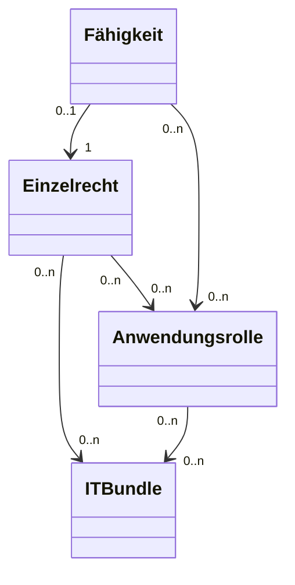

# README

## Datenmodell

### Resource (Ressource): Configuration Item
Resource is any asset, tangible or intangible, that an organization owns, leases, or utilizes to perform specific functions within an IT environment. This includes hardware like servers, software applications, network devices, and even human resources. 

Ressource bezieht sich auf jedes Asset, ob materiell oder immateriell, das eine Organisation besitzt, mietet oder nutzt, um spezifische Funktionen innerhalb einer IT-Umgebung auszuführen. Dazu gehören Hardware wie Server, Softwareanwendungen, Netzwerkgeräte und sogar personelle Ressourcen. 

### Resource Capability (Ressourcenfähigkeit oder Fähigkeit)
Resource Capability refers to the specific actions, functions, or operations that a resource—such as an application, system, IT component, or database element—can perform within an IT environment. This term includes the internal definition of roles within the resource itself, allowing for the mapping of these capabilities to functional roles like “Specialist” in complex applications. While defining capabilities internally can reduce complexity in external IAM tools, it should generally be the exception rather than the rule. Ideally, role-based access management should be centralized in IAM systems to maintain consistency and ease of management across the organization. Internal role definitions should only be used when necessary to address specific application requirements or complexities.

Ressourcenfähigkeit bezeichnet die spezifischen Aktionen, Funktionen oder Operationen, die eine Ressource—wie eine Anwendung, ein System, eine IT-Komponente oder ein Datenbankelement—innerhalb einer IT-Umgebung ausführen kann. Dieser Begriff umfasst auch die interne Definition von Rollen innerhalb der Ressource selbst, wodurch diese Fähigkeiten auf funktionale Rollen wie “Spezialist” in komplexen Anwendungen abgebildet werden können. Während die interne Definition von Fähigkeiten die Komplexität in externen IAM-Tools reduzieren kann, sollte dies im Allgemeinen die Ausnahme und nicht die Regel sein. Idealerweise sollte das rollenbasierte Zugriffsmanagement in zentralen IAM-Systemen erfolgen, um Konsistenz und einfache Verwaltung in der gesamten Organisation zu gewährleisten. Interne Rollendefinitionen sollten nur dann verwendet werden, wenn dies zur Bewältigung spezifischer Anwendungsanforderungen oder -komplexitäten erforderlich ist.

### Group
Within an authorization repository like Active Directory a Resource Capability is assigned to a group, which is then used to organize users and manage their access rights. The name of the group is typically based on the assigned Resource Capability, making it easier to identify and manage permissions within the authorization repository, such as Active Directory.
Groups in a repository typically follow a naming convention, often with prefixes. These prefixes can indicate function, department, or region, e.g., "GRP_" followed by additional details. This practice promotes a uniform structure, facilitates organization, and enables quick identification of the group's purpose.

In einem Autorisierungs-Repository wie Active Directory wird eine Resource Capability  einer Group (Gruppe) zugeordnet, die dann verwendet wird, um Benutzer zu organisieren und deren Zugriffsrechte zu verwalten. Der Name der Gruppe wird in der Regel nach der zugewiesenen Resource Capability benannt, was die Identifizierung und Verwaltung von Berechtigungen innerhalb des Autorisierungsrepositories wie Active Directory erleichtert.
Groups in einem Repository folgen üblicherweise einer Namenskonvention, oft mit Präfixen. Diese Präfixe können Funktion, Abteilung oder Region anzeigen, z.B. "GRP_" gefolgt von weiteren Details. Diese Praxis fördert eine einheitliche Struktur, erleichtert die Organisation und ermöglicht eine schnelle Identifizierung des Gruppenzwecks.

### Entitlement

### Resource Bundle

### Einzelrecht
- **Name**
- **Beschreibung**
- **Privilegiert** (ja/nein)
- **SoDArea**
- **Bestellbar** (ja/nein)

### ITBundle
- **Name**
- **Beschreibung**
- **Privilegiert** (ja/nein)
- **SoDArea**
- **Bestellbar** (ja/nein)

## Datenmodell-Beziehungen
- **Anwendung** 1..1 zu 0..n **Einzelrecht**
- **Anwendung** 1..1 zu 0..n **Anwendungsrolle**
- **Anwendung** 1..1 zu 0..n **ITBundle**
- **Einzelrecht** 0..n zu 0..n **Anwendungsrolle**
- **Einzelrecht** 0..n zu 0..n **ITBundle**
- **Anwendungsrolle** 0..n zu 0..n **ITBundle**
- **Fähigkeit** 1..1 zu 0..n **Einzelrecht**
- **Fähigkeit** 1..1 zu 0..n **Anwendungsrolle**

## Use Cases
1. **Anlegen, Anzeigen, Löschen, Ändern** von Attributen des jeweiligen Datenobjekts
2. **Pflege der Verbindungen** zwischen den Datenobjekten: Verlinken, Verlinkungen löschen
3. **Baumdarstellung** der Datenobjekte und deren Verbindung

## Datenmodell-Diagramm

